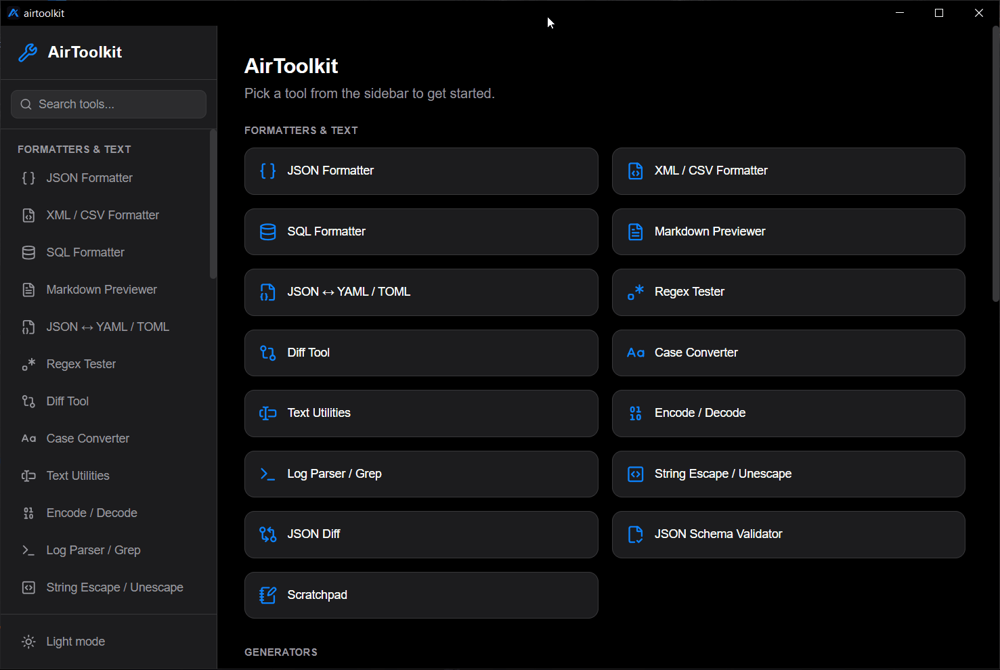

<div align="center">


# AirToolkit

**The developer toolbox for machines that can't reach the internet.**

38 everyday dev & IT utilities in one native desktop app — with **zero network calls**.
No telemetry. No auto-update. No CDNs. No phone-home. Ever.

[](#getting-started)
[](https://tauri.app/)
[](https://react.dev/)
[](https://www.typescriptlang.org/)
[](https://www.rust-lang.org/)
[](#-offline-verification)
[](LICENSE)

[Features](#-whats-inside) · [Why](#-why-airtoolkit) · [Offline verification](#-offline-verification) · [Getting started](#-getting-started) · [Roadmap](#-roadmap)

<br />



</div>

---

## ✈️ Why AirToolkit

AirToolkit came out of a real need: working on internet-restricted VMs at a
B2B security/access-control company, where opening a browser-based JSON
formatter or regex tester simply isn't an option.

Most "offline" dev-tool sites still ship analytics, font CDNs, or update
checks that fail loudly — or silently phone home — the moment they're
blocked. Pasting a production JWT, a private key, or a customer `.env` file
into a random website is a non-starter in a security-sensitive environment.

AirToolkit takes the opposite approach:

| Principle | What it means |
| --- | --- |
| 🔒 **Air-gapped by design** | The app makes no unsolicited network requests — verifiable at the OS level, not just promised. |
| 🧳 **Everything bundled** | Fonts, libraries, and assets ship inside the binary. Nothing is fetched at runtime. |
| 🖥️ **Native & lightweight** | A Tauri (Rust) shell instead of Electron — small install, fast startup, low memory. |
| 🕵️ **Your data stays local** | Tokens, certificates, keys, and logs are processed on-device and never leave it. |
| 🧰 **One app, many tools** | Stop juggling a dozen bookmarks you can't open anyway. |

> AirToolkit is also maintained as an open portfolio project.

---

## 🧰 What's Inside

38 tools, grouped by what you're trying to get done.

<table>
<tr>
<td valign="top" width="50%">

### 📝 Data & Formats
- **JSON Formatter / Validator**
- **JSON Structural Diff** — compare by key/value, not by line
- **JSON Schema Validator** — powered by `ajv`
- **JSON ↔ YAML / TOML Converter**
- **XML / CSV Formatter** — pretty-print, minify, table view
- **SQL Formatter**
- **Markdown Previewer** — live, sanitized rendering

### 🔐 Security & Crypto
- **JWT Decoder**
- **Hash / UUID Generator**
- **X.509 Certificate Decoder**
- **Certificate / CSR Generator** — RSA 2048/4096 or ECDSA P-256, keys generated locally
- **Password / Secret Strength Checker** — entropy, crack-time, pattern detection, generator

### 🔤 Text & Encoding
- **Encode / Decode** — Base64, URL, HTML entities
- **String Escape / Unescape** — JSON, shell, SQL, regex
- **Regex Tester**
- **Diff Tool**
- **Case Converter**
- **Text Utilities** — sort, dedupe, normalize, count

</td>
<td valign="top" width="50%">

### 🌐 Network & API
- **API Request Tester** ¹ — with built-in HTTP status reference
- **cURL ↔ Request Builder** — parses real devtools output
- **URL Parser / Builder**
- **Subnet / CIDR Calculator**
- **Network Port Reference**

### 🛠️ DevOps & IT
- **Cron Expression Explainer** — plus next 5 run times
- **Log Parser / Grep** — filters, invert-match, top repeated lines
- **dotenv Diff & Validator**
- **Timestamp Converter**
- **Number Base Converter**
- **System Info Panel** — OS, arch, locale, hostname, CPU, display

### 🎨 Files, Images & Media
- **Hex / Binary File Inspector** — hex dump + magic-byte detection
- **Base64 File Encoder** — file ↔ base64 / data URI
- **QR Code Generator & Reader**
- **Favicon / Image Asset Generator** — 8 PNG sizes + multi-res `.ico`
- **Color Tools** — HEX ↔ RGB ↔ HSL ↔ CMYK
- **Color Palette Extractor** — k-means dominant colors
- **Fake Data Generator** — names, emails, addresses, companies…
- **Scratchpad** — local multi-note notepad

</td>
</tr>
</table>

<sub>¹ The API Request Tester is the single deliberate exception to the zero-network posture — see below.</sub>

### A note on the API Request Tester

AirToolkit's core promise is that the **app itself** never makes a network
call on its own. The API Request Tester is an explicit, opt-in exception:
its entire purpose is to send an HTTP request **you** compose, on demand, to
a service on your own network. It changes nothing about the app's own
behavior — it still makes zero unsolicited calls — and this is called out in
the tool's own UI.

---

## 🛡️ Offline Verification

"Offline" is a claim worth checking, not just asserting. AirToolkit's
zero-network guarantee is verified two ways.

### 1. Static code audit — on every change

Run from the repo root. Each command should return **no matches**, or
matches only inside `src/pages/ApiTester.tsx`:

```bash
# Browser-side network primitives
grep -rn "fetch(\|XMLHttpRequest\|WebSocket\|EventSource\|sendBeacon" src/

# Rust-side network primitives (Tauri's HTTP plugin itself is expected —
# it's what ApiTester.tsx calls into; anything beyond that is not)
grep -rn "reqwest\|TcpStream\|UdpSocket" src-tauri/src/
```

Then confirm:

- `src-tauri/tauri.conf.json` has **no** `updater` or analytics block.
  Tauri's auto-updater is opt-in, so its absence means it's off.
- `src-tauri/capabilities/*` — the `http:default` permission is the only
  network capability granted, and it exists solely for the API Request
  Tester (its URL scope is open because the target host is whatever you
  type into that tool).

### 2. OS-level runtime block — before each release

Build the release binary, block all of its outbound traffic, and confirm
every tool except the API Request Tester still works identically:

```powershell
# Build first: npm run tauri build
$exe = "src-tauri\target\release\airtoolkit.exe"
New-NetFirewallRule -DisplayName "AirToolkit-Block-Out" -Direction Outbound `
  -Program (Resolve-Path $exe) -Action Block
```

Exercise a cross-section of tools (JSON formatter, hash/UUID, JWT decoder,
cert generator, hex inspector…). All should behave exactly as on an
unblocked run. The API Request Tester is **expected** to fail while the rule
is active — that failure confirms both that the block works and that it is
the only tool making real requests.

Clean up afterwards:

```powershell
Remove-NetFirewallRule -DisplayName "AirToolkit-Block-Out"
```

> 💡 For an even stronger guarantee, run the build inside a network-isolated
> VM (no virtual NIC, or a host-only adapter with no NAT).

**Status:** the static audit passes against the current codebase (all
Phase 1–6 tools) with no unexpected matches. The OS-level firewall/VM run
has not yet been performed against a signed release build.

---

## 🚀 Getting Started

### Prerequisites

- [Node.js](https://nodejs.org/) (LTS)
- [Rust](https://www.rust-lang.org/tools/install) (stable)
- Tauri's Windows prerequisites — Microsoft C++ Build Tools and WebView2
  ([guide](https://tauri.app/start/prerequisites/))

### Run in development

```bash
git clone https://github.com/Ayoub-EDAHLOULI/AirToolkit.git
cd AirToolkit
npm install
npm run tauri dev
```

### Build a release binary

```bash
npm run tauri build
```

The installer and executable are written to `src-tauri/target/release/`.
Copy them onto your air-gapped machine — no further downloads required.

---

## 🏗️ Tech Stack

| Layer | Technology |
| --- | --- |
| Native shell | [Tauri 2](https://tauri.app/) (Rust) — packaging, file dialogs, OS info |
| UI | [React 19](https://react.dev/) + [TypeScript](https://www.typescriptlang.org/) + [Tailwind CSS](https://tailwindcss.com/) |
| Build | [Vite](https://vite.dev/) |
| Key libraries | `@peculiar/x509`, `ajv`, `js-yaml`, `@iarna/toml`, `sql-formatter`, `marked` + `dompurify`, `qrcode`, `jsqr`, `cron-parser`, `cronstrue`, `@faker-js/faker` |

Every dependency is bundled at build time — nothing is loaded from a CDN.

---

## 🗺️ Roadmap

<details>
<summary><b>Phase 1 — MVP</b> ✅</summary>

- [x] JSON formatter / validator
- [x] Regex tester
- [x] Encode / decode (Base64, URL, HTML entities)
- [x] Hash / UUID generator
- [x] JWT decoder
- [x] Diff tool
- [x] Timestamp converter
- [x] Case converter
- [x] Number base converter

</details>

<details>
<summary><b>Phase 2 — Low complexity</b> ✅</summary>

- [x] XML / CSV formatter
- [x] Color tools
- [x] Markdown previewer
- [x] SQL formatter
- [x] Fake data generator
- [x] QR code generator

</details>

<details>
<summary><b>Phase 3 — Expanded capability surface</b> ✅</summary>

- [x] Cron expression parser / explainer
- [x] X.509 certificate decoder
- [x] Favicon / image asset generator
- [x] Color palette extractor
- [x] QR code reader
- [x] API request tester (the deliberate network exception)

</details>

<details>
<summary><b>Phase 4 — Developer / IT utilities</b> ✅</summary>

- [x] URL parser / builder
- [x] Subnet / CIDR calculator
- [x] Text utilities
- [x] Password / secret strength checker
- [x] Log parser / grep
- [x] dotenv diff & validator
- [x] JSON ↔ YAML / TOML converter
- [x] HTTP status code reference (panel inside the API Request Tester)

</details>

<details>
<summary><b>Phase 5 — Filling the gaps</b> ✅</summary>

- [x] String escape / unescape helper
- [x] JSON structural diff
- [x] Network port reference
- [x] cURL ↔ request builder
- [x] JSON Schema validator
- [x] Certificate / CSR generator
- [x] Hex / binary file inspector

</details>

<details>
<summary><b>Phase 6 — Final polish</b> ✅</summary>

- [x] Base64 file encoder
- [x] System info panel
- [x] Scratchpad

</details>

**Up next:** signed release build and a completed OS-level offline verification run.

---

## 🤝 Contributing

Issues and pull requests are welcome. The one non-negotiable rule:
**no new network calls.** Any change must keep the static audit above
clean, and new dependencies must be fully bundleable (no runtime CDN or
remote assets).

## 📄 License

Released under the [MIT License](LICENSE).

<div align="center">
<br />
<sub>Built for the machines the internet forgot. ✈️</sub>
</div>
